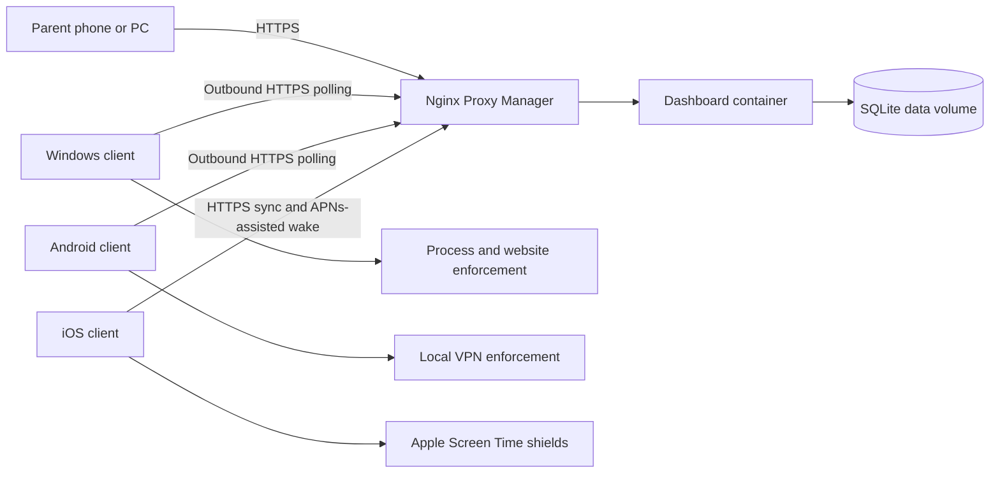

# Operation Crackdown

## Current implementation

This repository contains a working household focus-control stack:

- A zero-dependency Node.js dashboard/API using Node's built-in SQLite driver.
- A responsive parent dashboard with local accounts, device enrollment, a master switch, individual service controls, custom websites, discovered targets, and audit history.
- A Docker image and Compose deployment for a NAS behind Nginx Proxy Manager.
- A working Windows client with process enforcement, managed hosts entries, outbound policy polling, running-application discovery, privacy-limited start/stop activity, offline queues, and a loopback-only parent PIN page.
- An Android native client project using a foreground service and local-only `VpnService` package filtering.
- An iOS native client source project using Family Controls and Managed Settings, subject to Apple's required entitlement and signing process.
- Automated server, authentication, policy, discovery, and API integration tests.

The NAS image and Windows client have been exercised end to end. The Android source requires Android SDK 36/JDK 17 to compile and device-test. The iOS source requires macOS, Xcode, an Apple Developer account, and Family Controls entitlement approval.

Deployment instructions are in [docs/DEPLOYMENT.md](docs/DEPLOYMENT.md). Client installation and platform limitations are in [docs/CLIENTS.md](docs/CLIENTS.md).

## Purpose

Operation Crackdown is a lightweight family focus tool. It provides simple guardrails against casually opening Discord or other distracting applications and websites during homework, bedtime, or family time.

This is intentionally not surveillance software and is not designed as an adversarial parental-control system. It does not record messages, capture screens, inspect encrypted traffic, or attempt to defeat a determined administrator. Its job is to add enough friction to interrupt habitual checking while making the controls easy for either parent to operate.

The system has two layers:

- A dashboard and API running as a Docker container on the home NAS.
- A small client installed on every controlled Windows, Android, or iOS device.

The dashboard is published through the existing Nginx Proxy Manager instance. Every client has a unique server-issued device ID and credential and makes only outbound connections to the dashboard. No inbound port or router port-forward is required on a controlled device.

## User experience

The main dashboard should favor a few large controls instead of exposing technical firewall rules.

### Controls

- A per-device master switch pauses or resumes all enforcement without forgetting individual selections.
- Every built-in app or service has its own Allow/Block control.
- Parents can paste an additional domain or full URL into a device card. The server stores the hostname and the Windows client adds it to the managed hosts block.
- Discovered applications can be blocked directly without assigning them to a mode or profile.
- Changes remain in effect until changed unless a parent explicitly selects a temporary duration.

### Quick actions

- Turn all configured blocking off temporarily without losing selections.
- Turn all configured blocking back on.
- Enable or disable an individual application.
- Enable or disable Netflix, Paramount+, discovery+, Hulu, or YouTube individually.
- Add and block an additional website by pasting its domain or URL.
- See whether each device is online, pending synchronization, or last seen at a particular time.

### Internet pause and parent message

For Windows and Android devices, a parent can enter a short message such as `Feed the dogs, then let us know`, then choose **Pause internet and show message**. The device displays the message and pauses ordinary application traffic while keeping the Operation Crackdown control channel available. The same device card changes to a prominent **Restore internet** action. The pause remains active until a parent restores access.

The Windows client snapshots the existing outbound firewall defaults and enabled local outbound allow rules before changing them, permits only DNS, DHCP, and its own dashboard connection, and restores the original settings afterward. It verifies dashboard reachability after enforcement and immediately rolls back if the protected control channel fails. Its independent desktop emergency restore disables the agent without deleting enrollment and restores only Operation Crackdown's changes; the uninstaller uses the same saved state. Android routes all applications except the Operation Crackdown client into its local packet-drop VPN and posts the message as a high-priority notification.

iOS displays a synchronized parent-message notification and banner, but full device-wide internet suspension is not exposed in the dashboard for iOS because it requires additional Apple Network Extension or managed-device capabilities beyond Family Controls.

The master state, individual selections, temporary expiration, and parent who changed a control should be immediately visible. The interface should work well on a phone and desktop browser.

### Local parent override

Every client must provide a local Parent Override screen. This allows a parent physically using the controlled device to enter a PIN and adjust that device without first opening the NAS dashboard.

The local flow is:

1. Open `Parent Override` from the Windows tray application or the Android/iOS client.
2. Enter a parent PIN.
3. See the device's master state and resolved individual controls.
4. Change the master switch or an individual service, discovered application, or custom website.
5. Keep the default `Until changed`, or explicitly choose a temporary duration.
6. Apply the change immediately on that device.
7. Synchronize the override to the dashboard, where it becomes visible like an override created remotely.

The local screen is device-scoped. It does not edit another device or household-wide settings.

Where practical, each parent should have a separate PIN so the audit history can identify who made the change. The user interface may also support a single household parent PIN for simpler initial setup.

## Architecture



### Dashboard container

The NAS-hosted service provides:

- A responsive web dashboard.
- Parent authentication and sessions.
- Device enrollment and client authentication.
- Master enforcement and individual application, service, and website rules.
- One-time and recurring schedules.
- Desired policy state for every enrolled device.
- Client heartbeat, capabilities, and enforcement status for every enrolled device.
- A concise audit log of parent actions and client results.

SQLite is appropriate for this household-scale service. The database and server secret should live in a persistent Docker volume or bind-mounted NAS directory and be included in NAS backups.

### Device identity and inventory

Every client installation is a distinct enrolled device, even when multiple devices use the same Microsoft, Google, or Apple login. Identity belongs to the installation, not to the person's cloud account.

On enrollment, the server assigns an immutable random device ID. A device record includes:

- Device ID.
- Parent-editable display name, such as `Kid's PC` or `Kid's iPhone`.
- Platform and operating-system version.
- Client application version.
- Supported enforcement capabilities.
- Unique credential hash.
- Push token where applicable.
- Last check-in time.
- Desired policy revision.
- Last acknowledged policy revision.
- Current enforcement result and any degraded capability.

The dashboard home page shows a card for every enrolled client. Each card shows its friendly name, platform, online or last-seen state, master enforcement state, individual controls, and whether the latest policy has been confirmed.

Each card also has **Remove device**. Removal revokes that device credential and deletes its device-scoped policy, targets, and activity from the dashboard. The dashboard refuses removal while internet access is paused so a client cannot be stranded without its restore channel. Removing enrollment does not uninstall the local client; run the platform client uninstaller separately when the physical device is still available.

The device ID is not a secret. Authentication uses a separate high-entropy device credential. A request that merely knows or guesses a device ID cannot read or change policy.

### Discovered application targets

Clients report available application identities so parents can block household-specific distractions without editing server files. Reports include only a stable process/package key, display name, platform mapping, source, and category guess. They never include window titles, messages, document names, URLs, or captured content.

The Windows client also reports start and stop events for user-facing applications. Each event contains only a generated event ID, stable process key, display name, category guess, event type, and UTC timestamp. Events queue locally while the dashboard is unavailable. The server retains at most 30 days and 5,000 events per device, and the dashboard provides a direct Block action from the activity list.

An optional Manifest V3 browser extension reports top-level visited hostnames to the loopback Windows client. It deliberately strips page paths, query strings, searches, titles, fragments, content, and subframe/background traffic. The extension and Windows client both queue events during outages. Website events use the same 30-day and 5,000-event-per-device retention limit. The dashboard Activity area can show all activity or filter between Applications and Websites, with a direct Block action for either type.

- Windows reports applications with visible windows and marks them as currently running.
- Android reports launcher applications visible under Android's package-visibility rules. Android does not claim they are currently running.
- iOS cannot enumerate installed applications. The parent selects apps locally through Apple's Family Activity picker, and the client reports only a logical local-selection alias to the dashboard.

The dashboard lists these targets per device with direct Allow and Block controls. Selections become part of the resolved policy and are versioned like built-in service controls.

### Default service catalog

The server ships with a versioned catalog of logical services. A logical service gives the dashboard one stable control while hiding platform-specific enforcement details.

The initial catalog must include:

- **Communication and social:** Discord, Snapchat, Facebook/Messenger, Instagram, WhatsApp, Telegram, Signal, Slack, Teams, Google Chat, Google Messages, Zoom, Reddit, TikTok, and X/Twitter.
- **Gaming:** Roblox.
- **Streaming:** Netflix, Paramount+, discovery+, Hulu, and YouTube.

The dashboard exposes individual controls and a master pause/resume switch. A temporary change is optional; permanent `Until changed` behavior is the default.

Each service definition can contain:

```yaml
id: netflix
displayName: Netflix
category: streaming
windows:
  processes: []
  domains:
    - netflix.com
    - nflxvideo.net
android:
  packages:
    - com.netflix.mediaclient
ios:
  localSelectionKey: netflix
```

The example is illustrative rather than a complete Netflix hostname list. Production definitions must be tested and versioned because streaming providers change application packages, API endpoints, authentication hosts, and content-delivery domains. Catalog updates should be signed server data and should not require replacing every client executable.

The service abstraction is especially important across platforms:

- Windows usually combines process enforcement with domain blocking.
- Android maps a service to one or more application packages and domain groups.
- iOS maps the logical service to privacy-preserving app and website tokens selected and stored locally on that device.

YouTube requires deliberate handling because its domains are also used by embedded video, YouTube Music, and some educational content. The default YouTube control should clearly state that blocking it may also stop embedded YouTube videos on otherwise allowed websites. YouTube must remain separately controllable even when it belongs to the Streaming category.

### Local override synchronization

A local override is a first-class policy operation, not an untracked client-side exception. The client creates an operation resembling:

```json
{
  "operationId": "d41801e5-b0c8-47a6-a86a-759637226e6b",
  "deviceId": "780ac9b8-b91d-4dbf-8c56-3e279cd0c5eb",
  "baseRevision": 42,
  "source": "local-parent",
  "parentKeyId": "parent-a",
  "action": "allow",
  "targetType": "service",
  "targetId": "youtube",
  "effectiveUntil": "2026-09-01T23:00:00Z",
  "createdAt": "2026-09-01T22:12:00Z"
}
```

The client applies the change immediately, queues the operation durably, and posts it using its normal device credential. `operationId` makes retries idempotent, so a network interruption cannot create duplicate overrides.

When the server accepts the operation, it records the parent identity, source device, and `local-client` source in the audit log, creates a new policy revision, and returns the canonical resolved policy. The dashboard then shows the same active override and expiration that the local client shows.

If the dashboard is unreachable, the local override remains active according to its local expiration and the client displays `Saved locally; waiting to sync`. The queued operation is retried after connectivity returns.

Conflict handling is revision-based rather than clock-based:

- If `baseRevision` still matches, the server accepts the local operation.
- If the dashboard policy changed after the client last synchronized, the server rejects the stale operation with the current canonical policy.
- The client adopts the newer server policy, records the local operation as conflicted, and explains that a more recent dashboard change won.
- A parent can then reapply the local change against the new revision if still desired.

This prevents a phone that was offline for several days from reconnecting and silently overwriting a more recent dashboard decision.

### Windows client

The client should be a small native Windows application, preferably written in C# on a supported .NET release and published as a self-contained executable. It should:

- Start automatically with Windows.
- Authenticate to the server using a unique device credential.
- Fetch the desired policy over outbound HTTPS.
- Cache the most recently received policy locally.
- Reapply the cached policy after a reboot or temporary network outage.
- Stop configured applications while they are blocked.
- Apply and remove configured website blocks.
- Send heartbeat, version, and enforcement-result information to the server.
- Never accept arbitrary shell commands or executable code from the dashboard.

For the initial guardrail-level implementation, a scheduled task running at startup is sufficient. A Windows service can be used later if startup behavior is unreliable.

### Android client

The Android client should be written in Kotlin and use an Android foreground service for responsive policy polling. Android will display the required persistent system notification while the service is active.

For ordinary, non-enterprise-owned phones, the practical enforcement mechanism is Android's `VpnService`. This creates a local-only VPN on the phone; traffic does not need to leave the home through a commercial VPN provider. The client can route selected blocked application packages into the local VPN and discard their traffic while allowing other applications to use the network normally.

Important Android behavior:

- The client package and its dashboard HTTPS connection must be excluded from filtering or protected with `VpnService.protect()` so the control plane remains available.
- Only one VPN service can be active at a time. Operation Crackdown will conflict with another VPN or VPN-based ad blocker on the same phone.
- Android requires initial user approval for the VPN.
- Blocking an application package prevents its network access but may not prevent its interface from opening. For a distraction guardrail, an offline Discord screen is normally sufficient.
- Website groups can be blocked through DNS handling inside the local VPN.
- Android's fully managed device APIs can suspend packages more completely, but they require enterprise-style device-owner provisioning and usually a factory reset. They are out of scope for a normal family phone.

Android package mappings can be stored centrally. For example, the logical `discord` application maps to the package `com.discord` plus the shared Discord website group.

Official platform reference: [Android `VpnService`](https://developer.android.com/reference/android/net/VpnService.html).

### iOS and iPadOS client

The iOS client must be a native Swift application using Apple's Screen Time technology frameworks:

- **Family Controls** for authorization and private application selection.
- **Managed Settings** for shielding selected applications and websites.
- **Device Activity** for schedules that continue to run without the main app being open.

Apple requires the Family Controls capability and entitlement. Child authorization requires approval from a parent or guardian in the same Apple Family Sharing group. Distribution therefore requires an Apple Developer account, the approved entitlement, code signing, and a sustainable installation channel. A development build or expiring TestFlight build is not a suitable permanent household deployment.

Apple intentionally represents selected applications and web domains with privacy-preserving tokens. During iOS setup, the parent uses Apple's Family Activity picker on the device to select Discord and other apps. The iOS client stores those tokens locally and maps them to a dashboard logical rule such as `discord`; the server does not need to learn or store Apple's private tokens.

iOS cannot run a continuously listening background daemon. The control flow is therefore different:

1. The dashboard saves a new desired policy for the device.
2. The server sends an Apple Push Notification service request when available.
3. The iOS client syncs the latest policy when the system gives it background execution time or when the app opens.
4. The client applies Managed Settings shields and acknowledges the policy revision.
5. Device Activity extensions enforce already-installed local schedules without needing the main app to remain open.

Silent/background push delivery and background refresh are not guaranteed to be immediate. The dashboard must show `Change requested` until the iOS client acknowledges the new revision; it must not show the device as blocked merely because the parent pressed the button. Recurring schedules should be synchronized to the phone ahead of time so their enforcement does not depend on a just-in-time network wake.

The feasibility prototype for iOS must confirm entitlement approval, remote policy synchronization, token persistence, and shield behavior before the UI is treated as production-ready.

Official platform references: [Apple Family Controls](https://developer.apple.com/documentation/familycontrols), [Managed Settings shields](https://developer.apple.com/documentation/managedsettings/shieldsettings), and [Screen Time technology frameworks](https://developer.apple.com/documentation/ScreenTimeAPIDocumentation).

## Desired state instead of remote commands

The server should not send imperative commands such as `kill Discord now`. Instead, it stores a desired policy resembling:

```json
{
  "revision": 42,
  "profile": "homework",
  "effectiveUntil": "2026-09-01T22:00:00Z",
  "blockedCategories": ["streaming"],
  "blockedServices": ["discord"],
  "allowedServices": ["youtube"],
  "internetBlocked": false
}
```

Each client compares that policy with its device's current state and reconciles any difference. This has several advantages:

- A missed request does not permanently leave a device in the wrong state.
- The policy survives client, container, and NAS restarts.
- The server can show whether the client actually applied a policy.
- Expiration and scheduled changes are predictable.
- The API cannot become a general remote-administration channel.

Windows and Android can use HTTPS polling every 5–10 seconds. This is responsive enough for a household dashboard and easier to operate through a reverse proxy than a persistent connection. WebSockets or Server-Sent Events can be added later if instant changes become important. iOS uses best-effort APNs-assisted synchronization plus local Device Activity schedules because the operating system does not permit permanent background polling.

## The control channel must always survive enforcement

The client must remain able to contact the dashboard while a restriction is active. The dashboard connection is the system's control plane and must never be treated like ordinary blocked traffic.

For application and website profiles, this happens naturally on Windows: closing Discord or adding Discord domains to the hosts file does not affect the dashboard's HTTPS hostname. On Android, the client and its API connection bypass the filtering VPN. On iOS, the Operation Crackdown app and dashboard domain must never be among the selected Managed Settings shields. The dashboard hostname must never be permitted in a configurable website-block group on any platform.

Any future Offline profile requires explicit exceptions for the control plane. Its Windows Firewall policy must allow, at minimum:

- Outbound DNS needed to resolve the dashboard hostname.
- Outbound HTTPS to the dashboard endpoint through Nginx Proxy Manager.
- Traffic needed for normal TLS certificate validation when applicable.
- Local DHCP and network traffic required to maintain the PC's address and route.

The client should resolve and validate the configured dashboard hostname before activating Offline mode. If it cannot construct a working exception, it must refuse to enable that mode and report the failure. After applying the firewall rules, it should immediately perform a dashboard health check; if that check fails, it should roll back the Offline rules.

An Offline policy must also contain a finite expiration time that the client enforces locally. The client cannot rely exclusively on receiving a future unblock instruction, because the NAS, reverse proxy, DNS, or home network may be unavailable. When the locally stored expiration is reached, the client removes the Offline firewall rules even if it cannot contact the dashboard.

If the home router is used to pause the entire PC, the Windows client will necessarily lose contact with the dashboard. That pause must be reversed through the router app or interface, not through Operation Crackdown. The dashboard should clearly distinguish this router-level condition from its own policies rather than claiming the client is merely offline for an unknown reason.

## Enforcement approach

### Windows desktop applications

Each logical application has one or more Windows process names. For example:

```yaml
discord:
  displayName: Discord
  processes:
    - Discord.exe
    - DiscordCanary.exe
    - DiscordPTB.exe
```

While an application is blocked, the client should:

1. Detect a matching process.
2. Ask it to close normally.
3. Wait briefly.
4. Terminate it if it remains open.
5. Continue watching for it to reopen.

Matching by process name avoids depending on Discord's versioned installation directory. The client should report what it closed, but the dashboard does not need a detailed activity history. A simple event such as “Discord was closed while Homework mode was active” is sufficient and can be disabled if even that history is unwanted.

### Windows websites

The first implementation can manage marked entries in the Windows `hosts` file and flush the Windows DNS cache whenever the state changes. The client must only edit the block it owns, bounded by recognizable comments, and preserve all unrelated entries.

Example managed section:

```text
# BEGIN OPERATION CRACKDOWN
0.0.0.0 discord.com
0.0.0.0 www.discord.com
0.0.0.0 discord.gg
0.0.0.0 gateway.discord.gg
0.0.0.0 discordapp.com
0.0.0.0 discordapp.net
# END OPERATION CRACKDOWN
```

This is deliberately best-effort. A hosts file does not support wildcard domains, and application providers can add or change hostnames. Domain groups should therefore be data-driven and updateable from the server without updating the client executable.

If website blocking later proves unreliable, the preferred upgrade is a small browser extension managed by the client or a network DNS filtering service. HTTPS interception should not be used.

### Entire internet connection

An optional Offline profile can use Windows Defender Firewall rules created and owned by the client. Those rules must preserve the control-plane exceptions described above, pass a post-activation connectivity check, and have a locally enforced expiration. This feature has more failure modes than closing selected applications and should be added only after application blocking is stable. A router-level per-device pause remains a useful independent emergency cutoff, with the understanding that it can only be reversed at the router.

## Scheduling

The dashboard should support both temporary and repeating policies.

Examples:

- Homework every weekday from 4:00 PM to 6:00 PM.
- Deep Focus for the next 30 minutes.
- Discord blocked until 8:00 PM tonight.
- Normal mode for one hour as a temporary exception.

Store timestamps in UTC and store the household timezone separately, initially `America/Chicago`. Recurring schedules should be evaluated using the household timezone so daylight-saving changes behave naturally.

Policy precedence should be explicit:

1. A temporary individual-service exception wins until it expires.
2. A temporary parent profile override applies next.
3. The currently active recurring schedule applies next.
4. The default profile is used when none of the above is present.

The dashboard should show which rule produced the current policy rather than making parents infer it.

## Authentication and enrollment

### Parent access

The initial release should use two separate local parent accounts rather than a shared password. Requirements:

- Passwords hashed with Argon2id or an equivalent memory-hard algorithm.
- Secure, HTTP-only, same-site session cookies.
- Rate-limited login attempts.
- Optional TOTP two-factor authentication after the MVP.
- No self-service account registration after initial setup.

### Parent PINs

Parent PINs are separate from dashboard passwords. They authorize only local, device-scoped overrides.

- The server stores a slow password-hash verifier for each PIN, never the PIN itself.
- During device enrollment or PIN rotation, the client receives a device-specific offline verifier over the authenticated HTTPS channel.
- The verifier is protected locally with Windows DPAPI, Android Keystore-backed encrypted storage, or iOS Keychain.
- Successful validation produces the configured parent key ID for audit attribution; the raw PIN is never sent back with an override operation.
- Repeated incorrect attempts trigger an increasing local delay.
- PINs can be rotated, disabled, or removed from all clients in the dashboard.
- A lost or newly enrolled device does not automatically receive an old PIN verifier until a parent authorizes it.

Because this project is a household guardrail rather than high-assurance device management, offline PIN verification is an acceptable tradeoff. It enables local controls even when the NAS or home internet is temporarily unavailable.

If the NAS already has a trusted identity provider, OpenID Connect can be added later. It is not required for the MVP.

### Client enrollment

Enrollment should be intentionally short:

1. A parent creates a one-time enrollment code in the dashboard.
2. The client is installed and opened; Windows installation requests administrator permission for enforcement setup.
3. The client submits the code and basic device identity over HTTPS.
4. The server returns a random device ID and a separate long random device credential.
5. The client protects that credential using Windows DPAPI, Android Keystore, or iOS Keychain as appropriate.
6. The enrollment code immediately expires and cannot be reused.

Each client installation gets its own credential so a device can be revoked without affecting any other client.

## Reverse-proxy deployment

The dashboard container should listen only on an internal Docker port. Nginx Proxy Manager terminates TLS and forwards traffic to it.

A representative deployment shape is:

```yaml
services:
  dashboard:
    image: ghcr.io/example/operation-crackdown:latest
    restart: unless-stopped
    environment:
      APP_BASE_URL: https://focus.example.net
      HOUSEHOLD_TIMEZONE: America/Chicago
      DATABASE_PATH: /data/crackdown.db
    volumes:
      - ./data:/data
    expose:
      - "8901"
    networks:
      - proxy

networks:
  proxy:
    external: true
```

The final image name and environment variables will be defined when the application is implemented.

In Nginx Proxy Manager:

1. Create a Proxy Host such as `focus.example.net`.
2. Forward it to the container name and internal port `8901` on the shared Docker network.
3. Issue or select a valid TLS certificate.
4. Enable Force SSL and HTTP/2.
5. Do not expose the dashboard container's port directly to the internet.
6. Configure the public DNS record only if access from outside the home is desired.

The client must validate the public TLS certificate normally. Disabling certificate validation is not acceptable. If the dashboard is meant to be LAN-only, split DNS can resolve the hostname to the NAS's private address while Nginx Proxy Manager still serves a trusted certificate.

Nginx Proxy Manager's own access-list authentication should not replace application authentication because API clients need stable, purpose-specific credentials. It can be used as an additional outer layer for the human dashboard if desired, provided it does not interfere with the client API path.

## API outline

The exact routes may change, but the boundary should remain small.

### Parent API

- `POST /api/auth/login`
- `POST /api/auth/logout`
- `GET /api/devices`
- `GET /api/devices/{id}`
- `PUT /api/devices/{id}`
- `PUT /api/devices/{id}/override`
- `DELETE /api/devices/{id}/override`
- `GET /api/profiles`
- `PUT /api/profiles/{id}`
- `GET /api/services`
- `PUT /api/devices/{id}/services/{serviceId}/override`
- `DELETE /api/devices/{id}/services/{serviceId}/override`
- `PUT /api/devices/{id}/categories/{categoryId}/override`
- `DELETE /api/devices/{id}/categories/{categoryId}/override`
- `GET /api/schedules`
- `POST /api/schedules`
- `PUT /api/schedules/{id}`
- `DELETE /api/schedules/{id}`
- `GET /api/audit`
- `POST /api/enrollment-codes`

### Client API

- `POST /api/client/v1/enroll`
- `GET /api/client/v1/policy`
- `POST /api/client/v1/status`
- `POST /api/client/v1/push-token`
- `POST /api/client/v1/targets`
- `POST /api/client/v1/local-operations`
- `GET /api/client/v1/local-pin-verifiers`

The client API credential should identify the device; the device ID should not be accepted from an untrusted request body as authorization.

## Data model

The minimum persistent entities are:

- **Parent:** login identity and role.
- **Device:** random ID, name, platform, capability flags, credential hash, push metadata, version, last heartbeat, and policy revisions desired and applied.
- **Device group:** a parent-managed collection of clients belonging to the same child.
- **Device target:** a privacy-minimized process, package, or local-selection identity discovered by a client.
- **Device target profile:** assignment of a discovered target to Homework or Deep Focus.
- **Service definition:** stable logical ID, display name, category, Windows process/domain mappings, and Android package/domain mappings; iOS activity tokens remain local to the device.
- **Category:** collection of logical services, initially `social` and `streaming`.
- **Website group:** versioned domains used by one or more logical services.
- **Profile:** collection of blocked categories and services plus explicit service exceptions.
- **Schedule:** recurrence, start and end times, profile, and device.
- **Override:** temporary profile or exception with an expiration.
- **Local operation:** idempotent device-originated policy change with base revision, parent key ID, synchronization state, and conflict result.
- **Parent PIN verifier:** parent key ID plus slow hash parameters and device authorization state; never a recoverable PIN.
- **Audit event:** parent changes, enrollments, and high-level client results.

Do not store browsing history, message content, screenshots, keystrokes, or the titles of unrelated windows.

## Failure behavior

Safe and unsurprising behavior matters more than aggressive enforcement.

- If the dashboard is unreachable, the client retains the last valid policy until its stated expiration.
- If a temporary block expires while offline, the client returns to the applicable cached schedule or default profile.
- If the policy document is invalid, the client keeps the last valid policy and reports the error later.
- If hosts-file enforcement fails, application enforcement continues and the dashboard shows a degraded status.
- If an Offline rule prevents the client from reaching the dashboard health endpoint, the client immediately rolls that rule back.
- If an Offline policy expires while the dashboard is unreachable, the client removes the blocking firewall rules using its local clock.
- A Windows client installs only a newer dashboard-published runtime whose authenticated manifest and individual file hashes validate. It defers updates while internet access is paused and rolls back if the new agent does not report healthy.
- If an iOS device has not acknowledged a requested revision, the dashboard continues to show the change as pending instead of presenting an unverified state as successful.
- If a local parent override cannot reach the dashboard, the client applies it locally, stores it durably, and clearly reports that synchronization is pending.
- If a queued local override conflicts with a newer dashboard revision, the newer dashboard state wins and the client reports the rejected local operation.
- If the NAS restarts, persistent storage preserves accounts, devices, schedules, and overrides.

An emergency local recovery command should remove only Operation Crackdown's firewall and hosts-file changes. It should be documented with the installer and require administrator permission.

## Logging and privacy

Recommended audit events include:

- Parent signed in.
- Parent changed a profile or schedule.
- Parent started or ended an override.
- Client enrolled or was revoked.
- Client applied policy revision 42 successfully.
- Client failed to apply the website portion of a policy.

Routine process detections do not need to be retained. If they are retained for troubleshooting, use a short retention window and expose a switch to disable them. Server logs must never contain passwords, session cookies, enrollment codes, or device credentials.

## MVP scope

### Phase 1: shared server and Windows reference client

- Dockerized dashboard/API with SQLite persistence.
- Two local parent accounts.
- Unique enrollment and inventory for multiple clients.
- One enrolled Windows PC as the first reference implementation.
- Normal and Homework profiles.
- Discord desktop process enforcement.
- Discord website group through managed hosts entries.
- Default Streaming category with individual Netflix, Paramount+, discovery+, Hulu, and YouTube controls.
- Versioned Windows domain definitions for every default streaming service.
- Category-level and individual-service allow, block, and temporary-exception controls.
- Allow, block, 30-minute, one-hour, and “until time” controls.
- Client heartbeat and last-policy status.
- Basic parent audit history.
- Local Parent Override screen on Windows with offline PIN validation and durable synchronization.
- Windows running-application discovery and dashboard profile assignment.
- Manual Windows client installer and uninstall/recovery steps.

### Phase 2: Android client and daily convenience

- Recurring schedules.
- Editable application and website groups.
- Multiple controlled devices and device groups.
- Native Android client with foreground sync service.
- Android Parent Override screen using the same device-scoped operation model.
- Android per-package and DNS enforcement through a local `VpnService`.
- Android package and domain mappings for every default streaming service.
- Android launcher-application discovery and dashboard profile assignment.
- Verified control-plane bypass through the Android VPN.
- Deep Focus profile.
- TOTP authentication.
- Authenticated automatic Windows client updates with health verification and rollback.
- Backup and restore documentation.

### Phase 3: iOS client

- Apple Developer signing and Family Controls entitlement approval.
- Native Swift client and Screen Time API extensions.
- iOS Parent Override screen using the same device-scoped operation model.
- On-device Family Activity selection and logical-rule mapping.
- Required on-device mapping for Netflix, Paramount+, discovery+, Hulu, and YouTube during enrollment or setup.
- Privacy-preserving reporting of configured local-selection aliases; no iOS installed-app enumeration.
- Managed Settings shields for applications and websites.
- Device Activity schedules stored on the phone.
- APNs-assisted policy synchronization.
- Explicit requested, delivered, and confirmed states in the dashboard.

### Phase 4: optional enhancements

- Offline profile using Windows Firewall.
- Browser extension for stronger website handling.
- OpenID Connect integration.
- Push updates using Server-Sent Events or WebSockets.
- Native Android and iOS update-version reporting; their packages continue through their platform stores or managed deployment channels.
- Progressive web app installation on parent phones.

## Acceptance criteria for the MVP

The first release is complete when:

1. Either parent can securely sign in from a phone.
2. A parent can start Homework mode for 30 minutes in no more than two taps after login.
3. An open Discord client closes within 10 seconds.
4. Discord cannot remain open while Homework mode is active.
5. The Discord website is blocked in the household's normal browser configuration.
6. The dashboard shows the controlled PC's online status and last successful policy revision.
7. A reboot of the PC or NAS does not lose the active policy or schedules.
8. An expired temporary block reliably returns to the correct default or scheduled profile.
9. Uninstalling the client removes only the system changes it created.
10. No port is opened inbound to the controlled PC.
11. Every selective block leaves the dashboard control channel operational.
12. A future Offline mode cannot activate without a verified dashboard exception and cannot remain active beyond its locally stored expiration.
13. Every client installation has a unique device ID and credential and appears separately in the dashboard inventory.
14. Android can block Discord network access without blocking its own dashboard connection.
15. iOS applies a locally synchronized Discord shield and the dashboard distinguishes requested policy from device-confirmed enforcement.
16. The dashboard can block or allow the entire Streaming category on one device or device group.
17. Netflix, Paramount+, discovery+, Hulu, and YouTube can each be overridden independently for a fixed duration or until a selected time.
18. Every client reports whether each requested default service control was applied, unsupported, or degraded on that platform.
19. A parent can enter a PIN locally on every supported client and immediately change that device's profile, category, or service state.
20. An accepted local change appears on the dashboard with its source, parent identity, duration, and resulting policy revision.
21. A local change made while offline is durable, expires correctly using the device clock, and synchronizes or reports a revision conflict after reconnection.
22. Windows and Android report privacy-minimized available targets, and an admin can assign each target independently to Homework or Deep Focus.
23. Discovered-target payloads contain no window titles, message content, document names, or browsing history.

## Recommended implementation direction

For a maintainable small system:

- **Server:** ASP.NET Core or Go, with server-rendered pages or a small embedded web UI.
- **Database:** SQLite with migrations.
- **Windows client:** C#/.NET self-contained executable.
- **Android client:** Kotlin with a foreground service and local `VpnService`.
- **iOS client:** Swift with Family Controls, Managed Settings, Device Activity extensions, and APNs.
- **Transport:** Versioned JSON API over HTTPS with short polling.
- **Packaging:** Multi-stage Docker build for the server and a signed or checksummed Windows release artifact.

Using ASP.NET Core for both the server and client maximizes shared models and validation code. Using Go for the server produces a particularly small container. Either is reasonable; operational simplicity and test coverage matter more than framework choice.

The implementation should start with Discord only. Once the complete path—dashboard, schedule, policy, client reconciliation, and reporting—is reliable, additional applications become configuration rather than new architecture.
